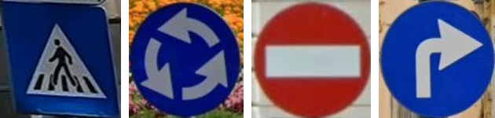
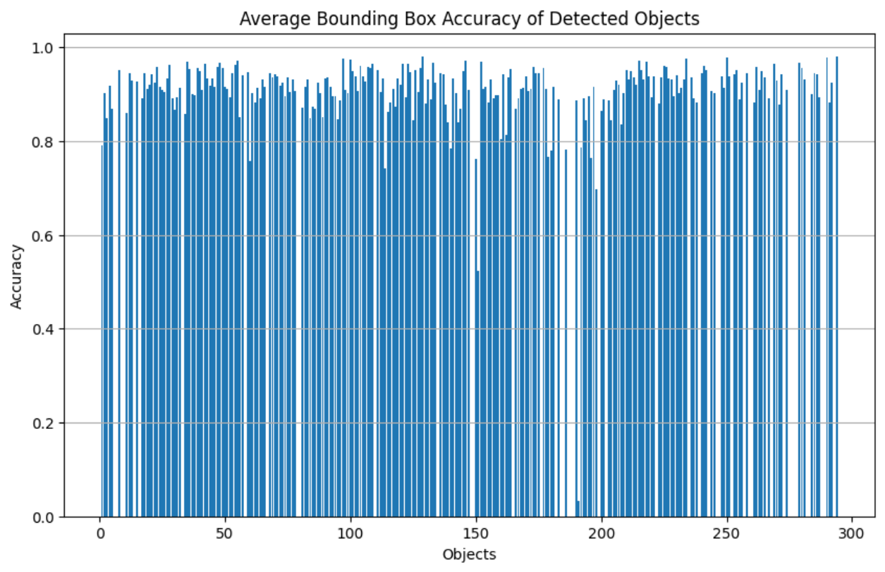
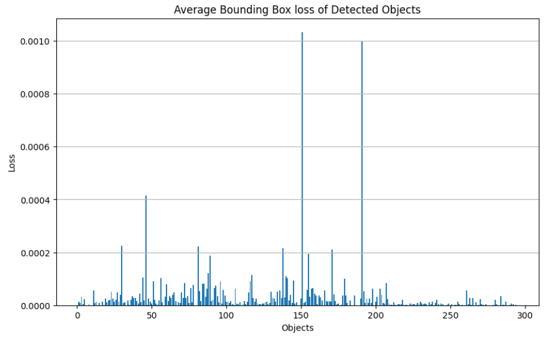
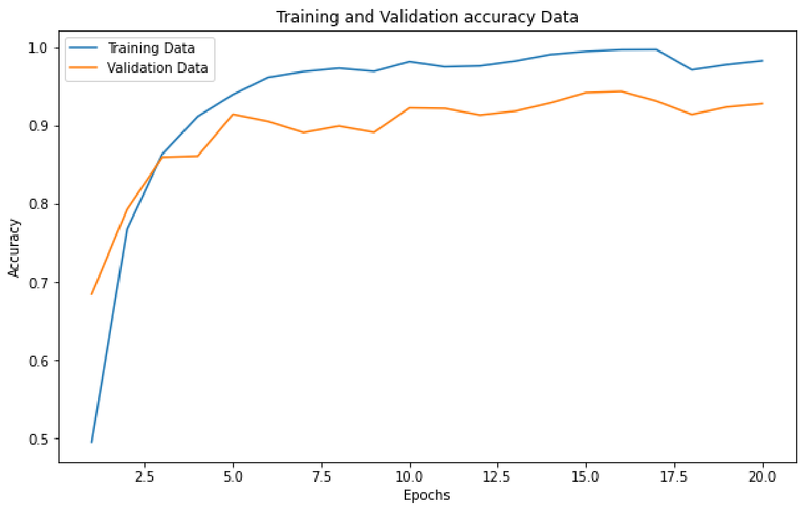
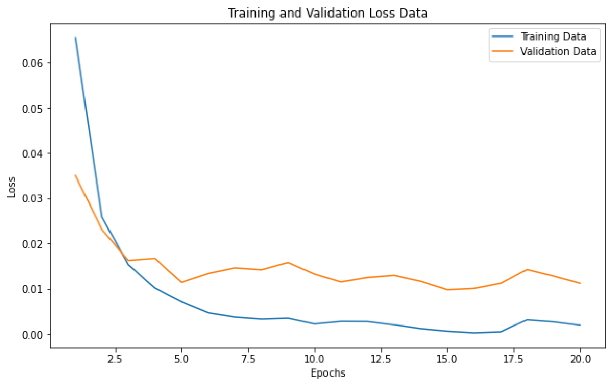
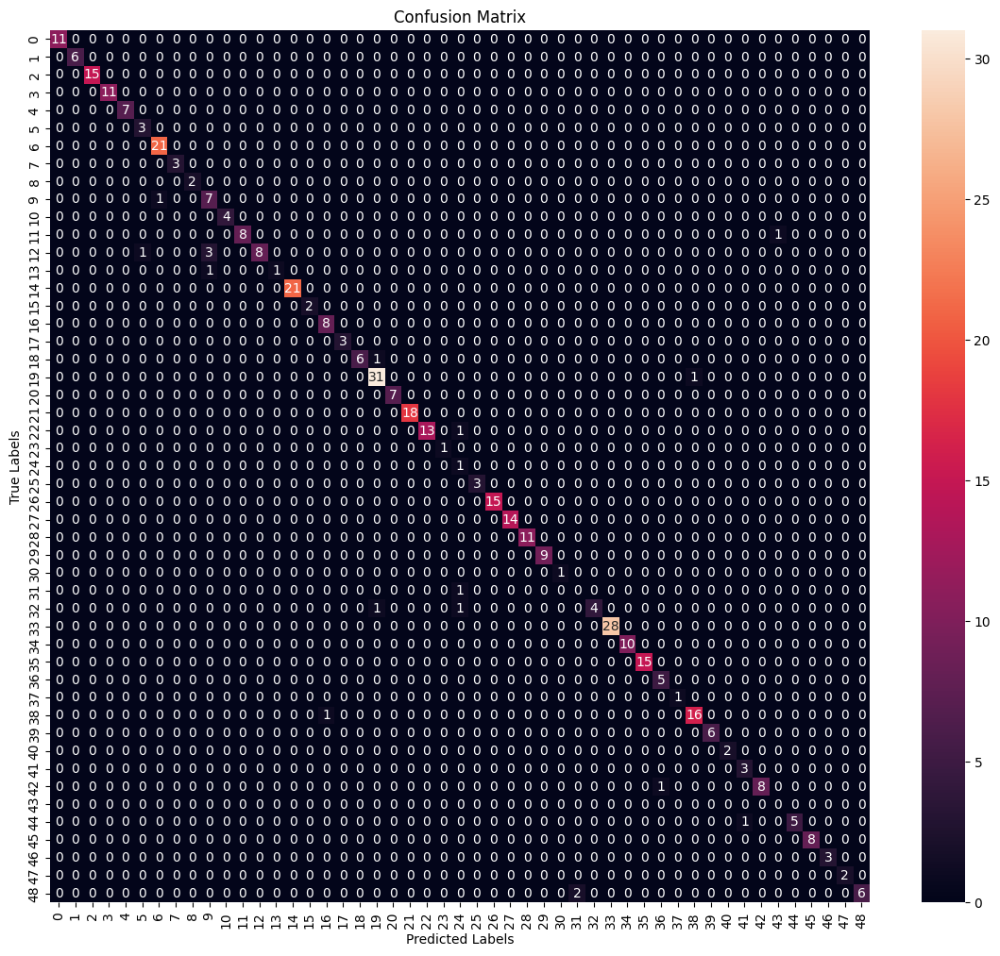

# Real-Time Traffic Sign Recognition and Classification

A two-stage pipeline for finding and classifying road signs in images. A fine-tuned
YOLOv8 model locates the signs, then each detection is cropped and passed to a
classifier that assigns it to one of 55 European traffic-sign classes. The classifier
is a fusion of a Vision Transformer and a ResNet-34, which did a little better than
either network on its own.

On the pipeline test set the combined system scores about 93% (90.8% detection,
95.6% classification on the resulting crops).

*Signs cropped from the YOLO detections — the input the classifier actually sees.*

## Results

Full pipeline (`final_project.ipynb`), evaluated on the detection test split:

| Stage | Model | Metric | Score |
|---|---|---|---|
| Detection | YOLOv8s, fine-tuned | mean IoU vs. ground-truth boxes | 90.75% |
| Classification | ViT + ResNet-34 fusion, on YOLO crops | accuracy | 95.62% |
| Overall | — | 0.5·IoU + 0.5·accuracy | 93.19% |

*IoU between each predicted box and its ground-truth box, one bar per detected sign in
the test set.*

Standalone classifier comparison (`image_classification_models.ipynb`), on its own
random test split of the cropped-sign dataset:

| Model | Test accuracy |
|---|---|
| VGG-13 | 81.04% |
| ResNet-34 | 72.59% |
| Vision Transformer | 89.30% |
| ViT + ResNet-34 fusion | 92.26% |

The fusion model appears in both tables because `final_project.ipynb` and
`vit_resnet34_fusion_model.ipynb` evaluate it on different test splits.

Fusion model over 20 training epochs:

## How it works

1. **Detect.** YOLOv8s (COCO-pretrained) is fine-tuned on the traffic-sign data for
   15 epochs at 640×640.
2. **Crop.** Predicted boxes are used to cut each sign out of the image.
3. **Classify.** Crops are resized to 40×40, lightly Gaussian-blurred and normalised,
   then fed to the fusion model:
   - ResNet-34 produces a 169-d embedding,
   - a small ViT (3×3 patches, 12 layers, 13 heads) produces another 169-d embedding,
   - the two are concatenated, run through a 1-D convolution and a linear layer, and
     mapped to the 55 classes.

## Repository contents

| File | Purpose |
|---|---|
| `final_project.ipynb` | End-to-end pipeline: fine-tune YOLO, run detection on the test set, crop, classify with the fusion model, report per-stage and overall metrics. |
| `image_classification_models.ipynb` | Trains and compares the standalone classifiers (VGG-13, ResNet-34, ViT) on cropped signs. |
| `vit_resnet34_fusion_model.ipynb` | Data preparation (crop from YOLO labels, merge train/val, normalise class-folder names) and training of the fusion model. |
| `data.yaml` | YOLO dataset config — split paths and the 55 class names. |
| `dataset.txt` | Link to the dataset. |

Trained weights and the dataset are not committed to the repo.

## Dataset

[Traffic Signs Detection – Europe](https://universe.roboflow.com/radu-oprea-r4xnm/traffic-signs-detection-europe)
(Roboflow Universe v11; also on [Kaggle](https://www.kaggle.com/datasets/raduoprea/traffic-signs)),
released under CC BY 4.0.

- 55 classes, all images 640×640.
- Class names are prefixed by type: `forb_` (prohibitory), `info_` (informational),
  `mand_` (mandatory), `prio_` (priority), `warn_` (warning).
- The class distribution is imbalanced and roughly tracks how often each sign occurs
  in practice.

## Running it

The notebooks were written for Google Colab (Tesla T4) and use `/content/...` paths
throughout, so expect to fix those paths if you run them elsewhere.

Rough order:

1. Export the dataset from Roboflow in YOLOv8 format.
2. `vit_resnet34_fusion_model.ipynb` — build the cropped-sign dataset and train the
   fusion model, saved as `vit_resnet_model.pth`.
3. `image_classification_models.ipynb` — optional, reproduces the classifier
   comparison table.
4. `final_project.ipynb` — fine-tunes YOLO, then runs the full pipeline. Expects
   `data.yaml` and `vit_resnet_model.pth` in the working directory.

Main dependencies: `torch`, `torchvision`, `ultralytics`, `opencv-python`,
`scikit-learn`, `matplotlib`, `seaborn`.

## References

- Dataset: R. Oprea, *Traffic Signs Detection – Europe*, Roboflow Universe.
- Detection: [Ultralytics YOLOv8](https://docs.ultralytics.com/).
- Classifier: Dosovitskiy et al., *An Image is Worth 16×16 Words: Transformers for
  Image Recognition at Scale*, 2020 — https://arxiv.org/abs/2010.11929
